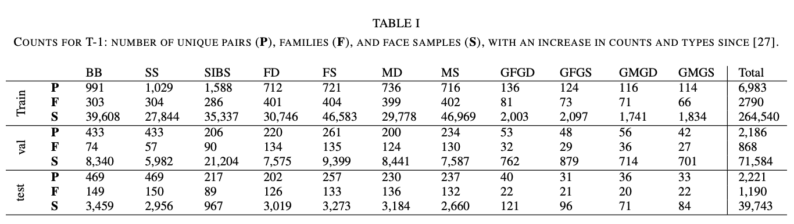
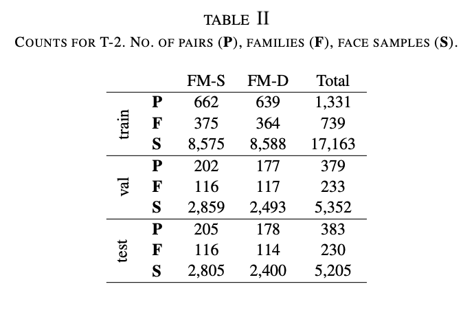
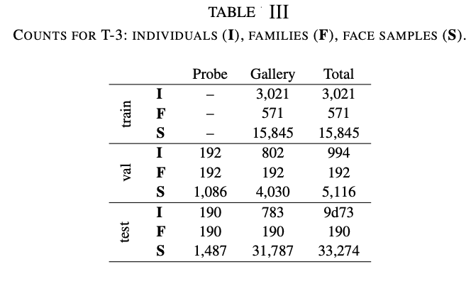

# <h1><a id="user-content-fiw-data-development-kit" class="anchor" aria-hidden="true" href="#fiw-data-development-kit"><svg class="octicon octicon-link" viewBox="0 0 16 16" version="1.1" width="16" height="16" aria-hidden="true"><path fill-rule="evenodd" d="M4 9h1v1H4c-1.5 0-3-1.69-3-3.5S2.55 3 4 3h4c1.45 0 3 1.69 3 3.5 0 1.41-.91 2.72-2 3.25V8.59c.58-.45 1-1.27 1-2.09C10 5.22 8.98 4 8 4H4c-.98 0-2 1.22-2 2.5S3 9 4 9zm9-3h-1v1h1c1 0 2 1.22 2 2.5S13.98 12 13 12H9c-.98 0-2-1.22-2-2.5 0-.83.42-1.64 1-2.09V6.25c-1.09.53-2 1.84-2 3.25C6 11.31 7.55 13 9 13h4c1.45 0 3-1.69 3-3.5S14.5 6 13 6z"></path></svg></a>FIW Data Development Kit</h1>

## Introduction
Python tools for automatic kinship recognition in images and videos.Python tools for automatic kinship recognition in images and videos.

* This is the documentation of the visual kinship recognition toolbox and tools specific to the [FIW](https://web.northeastern.edu/smilelab/fiw/) dataset (i.e., FIW data development kit). If you want the Places-CNN models instead of the training data, please refer to the [FIW-models](https://github.com/jvison/pykin).

## Brief overview of contents:

- [Project Detail](#version)
- [Data Desciption](#Details-of-the-data)
- [Referencees](#tag2020)
- [License](#license)
- [To Do](#to-do)
- [License](#license)
- [Getting Involved](#getting-involved)


## Introduction

Python tools for automatic kinship recognition in images and videos.Python tools for automatic kinship recognition in images and videos.

- This is the documentation of the visual kinship recognition toolbox and tools specific to the [FIW](https://web.northeastern.edu/smilelab/fiw/) dataset (i.e., FIW data development kit). If you want the Places-CNN models instead of the training data, please refer to the [FIW-models](https://github.com/jvison/pykin).
- Demos for Recognizing Families In the Wild (RFIW)
  [5th Edition](https://medium.com/to-recognize-families-in-the-wild-a-machine-vision/rfiw2021-7ceb357a39a6):
  - [Track 1](https://competitions.codalab.org/competitions/21843), Verification;
  - [Track 2](https://competitions.codalab.org/competitions/22117), Tri-Subject Verification;
  - [Track 3](https://competitions.codalab.org/competitions/22152), Search & Retrieval.

This repo is a work in progress and all contributions and requests are welcome.

**In summary, the following items are available:**

- Version and contact information, download links, along with a brief description of the different download options.

- Overview of the API, its purpose, contents, and premiere features.

- Image data details for FIW-Standard and RFIW-Challenge.

  1. Image list and annotations
  2. Submission format
  3. Evaluation routines

- Overview of the FIW data development kit.

- List of action items (tentative; open to requests and PRs)

This repo serves as the main set of tools for kinship recognition effort, including the FIW database. Besides, the next section is detailed description of database (i.e., data and label) structure.

Please contact Joseph Robinson [robinson.jo@northeastern.edu](robinson.jo@northeastern.edu) for questions, comments, or bug reports.

Download data and learn more about it here [https://web.northeastern.edu/smilelab/fiw/](https://web.northeastern.edu/smilelab/fiw/).

---

# Families In the Wild Database

FIW can be obtained from two primary locations: the main dataset (i.e., raw data, experimental splits, and more) [downloads page](https://web.northeastern.edu/smilelab/fiw/download.html), along with task-specific data splits on codalab (i.e., [Task 1](https://competitions.codalab.org/competitions/21843), [Task 2](https://competitions.codalab.org/competitions/22117), and [Task 3](https://competitions.codalab.org/competitions/22152)), which were at one time used for data challenge (i.e., [2020 RFIW](https://arxiv.org/pdf/2002.06303.pdf) in conjunction with the [IEEE FG Conference](https://fg2020.org/)). Oncce download, we suggest to decompress the files in the data to their own folder.

## FIW Data and Labels

This documentation describes FIW DB and (working) development kit. This is work in progress (i.e., still to come are FIW-CNN models, updated benchmarks, more in README (this), and more).

Check out FIW [project page](https://web.northeastern.edu/smilelab/fiw/index.html)

## Download

Download [here](https://web.northeastern.edu/smilelab/fiw/download.html)

## DB Contents and Structure

- _FIW_PIDs.csv:_ Photo lookup table. Each row is an image instance, containing the following fields:
  - _PID:_ Photo ID
  - _Name:_ Surname.firstName (root reference for given family)
  - _URL:_ Photo URL on web
  - _Metadata:_ Text caption for photo
- _FIW_FIDs.csv:_ FID (family)/ Surname lookup table.
  - _FID:_ Unique ID key assigned to each family.
  - _Surname:_ Family Name corresponding to FID key.
- _FIW_RIDs.csv:_ Relationship lookup table with keys [1-9] assigned to relationship types.

- _FIDs/_
  - _FID####/_ Contains labels and cropped facial images for members of family (1-1000)
    - _MID#/:_ Face images of family member with ID key <N>, i.e., MID #.
    - _F####.csv:_ File containing member information of each family:
      - _relationships matrix:_ representation of relationships.
      - _name:_ First name of family member.
      - _gender:_ gender of family member.

For example:

```
FID0001.csv

	MID     1     2     3     Name    Gender
	 1      0     4     5     name1     F
	 2      1     0     1     name2     F
	 3      5     4     0     name3     M

```

Here we have 3 family members, as listed under the MID column (far-left). Each MID reads acorss its row.

We can see that MID1 is related to MID2 by 4->1 (Parent->Sibling), which of course can be viewed as the inverse, i.e., MID2->MID1 is 1->4. It can also be seen that MID1 and MID3 are Spouses of one another, i.e., 5->5. And so on, and so forth.

## Statistics







# Publications

[Papers on FIW](https://web.northeastern.edu/smilelab/fiw/publications.html) describe the data collection processes and details; supplemental to this is the [FIW Data Card]("DatasheetForFiw/main.pdf") below. Note that the Latex source file for the datasheet could be borrowed as a tempalate for another dataset of similar structure. Check out [repo](https://github.com/visionjo/DatasheetForFIW/tree/master), as well as [DatasheetForFiw/main.pdf](DatasheetForFiw/main.pdf).

## 2021

<div class="ref"> Joseph P. Robinson, Ming Shao, and Yun Fu. 
<a href=https://arxiv.org/abs/2006.16033>Survey on the Analysis and Modeling of Visual Kinship: A Decade in the Making.</a>
<i>IEEE Transactions on Pattern Analysis and Machine Intelligence (2021)</i>.</div>
<div class="links"><a href=https://arxiv.org/pdf/2006.16033.pdf>PDF</a></div>

```bibtex
@ARTICLE{robinsonSurvey2021,
  author={Robinson, Joseph Peter and Shao, Ming and Fu, Yun},
  journal={IEEE Transactions on Pattern Analysis and Machine Intelligence (TPAMI)},
  title={Survey on the Analysis and Modeling of Visual Kinship: A Decade in the Making},
  year={2021},
  pages={1-1},
  doi={10.1109/TPAMI.2021.3063078},
  }
```

<div class="ref">Joseph P. Robinson, Yu Yin, Zaid Khan, Ming Shao, and Yun Fu.
<a href="https://competitions.codalab.org/competitions/21843">Families In Wild Multimedia (FIW MM): A Multimodal 
Database for Recognizing Kinship.</a> <i>IEEE Transactions on Multimedia (2021)</i>.</div>
<div class="links"><a href=https://arxiv.org/pdf/2006.16033.pdf>PDF</a></div>

```bibtex
@ARTICLE{robinsonfiwmm,
  author={Robinson, Joseph Peter and Yin, Yu and Khan, Zaid and Shao, Ming and Fu, Yun},
  journal={IEEE Transactions on Multimedia (TMM)},
  title={Families In Wild Multimedia (FIW MM): A Multimodal Database for Recognizing Kinship},
  year={2021},
  }
```

## 2020

<div class="ref">Joseph P. Robinson, Yu Yin, Zaid Khan, Ming Shao, Siyu Xia, Michael Stopa, Samson Timoner, Matthew A. Turk, Rama Chellappa, and Yun Fu.  
<a href=https://arxiv.org/abs/2002.06303>Recognizing Families In the Wild (RFIW): The 4th Edition</a> 
<i>IEEE International Conference on Automatic Face & Gesture Recognition.</i></div>
<div class="links"><a href=https://arxiv.org/pdf/2002.06303.pdf>PDF</a></div>

```bibtex
@article{robinson2020recognizing,
    title={Recognizing Families In the Wild (RFIW): The 4th Edition},
    author={Robinson, Joseph P and Yin, Yu and Khan, Zaid and Shao, Ming and Xia, Siyu and
            Stopa, Michael and Timoner, Samson and Turk, Matthew A and Chellappa, Rama and Fu, Yun},
    journal={arXiv preprint arXiv:2002.06303},
    year={2020}
}

```

## 2018

<div class="ref">Joseph P. Robinson, Ming Shao, Yue Wu, Hongfu Liu, Timothy Gillis, and Yun Fu. <a href=https://web.northeastern.edu/smilelab/fiw/papers/tpami-final.pdf>Visual Kinship Recognition of Families in the Wild.</a> 
<i>IEEE International Conference on Automatic Face & Gesture Recognition (2018)</i>.</div>
<div class="links"><a href=https://arxiv.org/pdf/2002.06303.pdf>PDF</a></div>

```bibtex
@article{robinson2018visulkinship,
	title={Visual Kinship Recognition of Families in the Wild},
	author={Robinson, Joseph P and Shao, Ming and Wu, Yue and Liu, Hongfu and Gillis, Timothy and Fu, Yun},
	journal={IEEE Transactions on pattern analysis and machine intelligence (TPAMI) Special Issue: Computational Face},
	year={2020}
}
```

## <a name="tag2016">2016</a>

<div class="ref">Joseph P. Robinson, Ming Shao, Yue Wu, Yun Fu. <a href=https://web.northeastern.edu/smilelab/fiw/papers/tpami-final.pdf>Families in the Wild (FIW): Large-scale Kinship Image Database and Benchmarks</a> 
<i>IEEE International Conference on Automatic Face & Gesture Recognition</i> (2016).</div>
<div class="links"><a href=https://web.northeastern.edu/smilelab/fiw/papers/acm-mm-short-final.pdf>PDF</a></div>

```bibtex
@article{robinson2016families,
  title="Visual Kinship Recognition of Families in the Wild",
  author="Robinson, Joseph P and Shao, Ming and Wu, Yue and Liu, Hongfu and Gillis, Timothy and Fu, Yun",
  journal="ACM on Multimedia Conference",
  year="2016"
}
```

A more complete list of references can be found [here](https://web.northeastern.edu/smilelab/fiw/publications.html).

---

# Organization

## License

By downloading the image data you agree to the following terms:

1. You will use the data only for non-commercial research and educational purposes.
2. You will NOT distribute the above images.
3. Northeastern University makes no representations or warranties regarding the data, including but not limited to warranties of non-infringement or fitness for a particular purpose.
4. You accept full responsibility for your use of the data and shall defend and indemnify Northeastern University, including its employees, officers and agents, against any and all claims arising from your use of the data, including but not limited to your use of any copies of copyrighted images that you may create from the data.

See Download links (and Terms and Conditions) [here](https://web.northeastern.edu/smilelab/fiw/download.html).

## Version

**0.1.0**
Created: 16 January 2020

## Authors

- **Joseph Robinson** - [Github](https://github.com/visionjo) - [web](http://www.jrobsvision.com)
- **Zaid Khan** - [Github](https://github.com/codezakh)

## Bugs and Issues

Please bring up any questions, comments, bugs, PRs, etc.

---

# To Do

- [ ] Finish documentation
- [ ] Demo for Track 1
- [ ] Demo for Track 2
- [ ] Demo for Track 3
- [ ] Dataloader
- [ ] Publish results (all baselines)

# Disclaimer

<div>
<div class="paragraph">If you found our data and resources useful please cite our works [above]().
</div>

---

<p><small>Project based on the <a target="_blank" href="https://drivendata.github.io/cookiecutter-data-science/">cookiecutter data science project template</a>. #cookiecutterdatascience</small></p>
